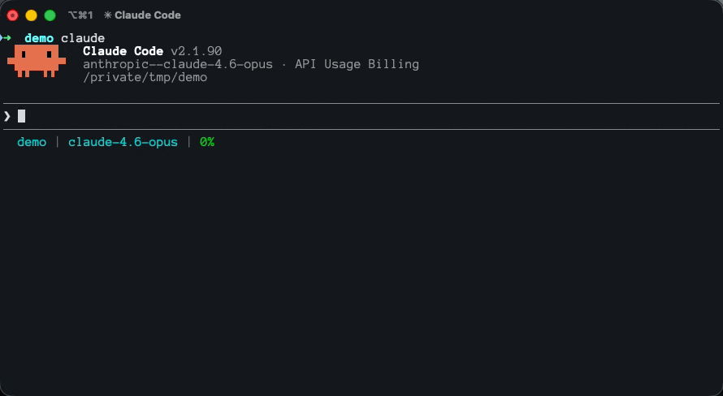

<br>

<p align="center">
  
  
</p>

<h1 align="center">The <span style="color:orange">hub</span> for AI Skills</h1>

<p align="center">
Publish, discover, and use AI agent skills across all platforms.<br>
Connect the MCP server once and every skill on the registry becomes instantly available — no local installation needed.
</p>

<br>

<p align="center">
  
</p>

## 💡 Why iKhono?

AI coding agents are powerful but generic. **Skills** give them specialized expertise — security review, test writing, API design — crafted by the community.

- 🔌 **Use a skill**: Connect the MCP server and search for what you need
- ✏️ **Create a skill**: Write a SKILL.md, publish with one command
- 🌍 **Share a skill**: Your skills work on Claude, Cursor, Windsurf, Copilot, and Codex

## 🚀 Quick Start

### 1. Add the MCP Server

**Fastest way (any platform):**
```bash
npm install -g @ikhono/cli
ikh setup --platform claude
```

**Or manually (Claude Code):**
```bash
claude mcp add ikhono -- npx -y @ikhono/mcp
```

**Cursor / Windsurf / Copilot:** See [platform setup guides](docs/platforms/).

### 2. Use Skills

Once connected, your AI agent can search and load skills automatically. Just ask:

> "Search iKhono for a code review skill"

Or the agent will suggest skills when it detects a relevant task.

### 3. Explore

| Action | Command | What Happens |
|--------|---------|-------------|
| **Search** | `/skill search` | Find skills by query, category, or author |
| **Load** | `/skill load` | Load full instructions into your AI agent |
| **Pin** | `/skill pin` | Save favorites for quick access |
| **Unpin** | `/skill unpin` | Remove a skill from favorites |
| **List Pinned** | `/skill list-pinned` | Show your pinned skills |
| **Rate** | `/skill rate` | Help the community find the best skills |

## 🔍 How It Works

```
You  -▶  AI Agent  -▶  iKhono MCP Server  -▶  iKhono Registry
                              ⬇
                            search
                              ⬇
                    Skills loaded on-demand
                      into your AI agent
```

The MCP server is a **thin proxy** — it connects your AI agent to the iKhono registry. When you (or your agent) search for a skill, the instructions are fetched and injected into the conversation. No files downloaded, no local setup.

## 🖥 Supported Platforms

| Platform | Setup Guide | Status |
|----------|-------------|--------|
| [Claude Code](docs/platforms/claude-code.md) | `.claude/settings.json` | Supported |
| [Cursor](docs/platforms/cursor.md) | `.cursor/mcp.json` | Supported |
| [Windsurf](docs/platforms/windsurf.md) | `.windsurf/mcp.json` | Supported |
| [GitHub Copilot](docs/platforms/copilot.md) | `.vscode/mcp.json` | Supported |
| [OpenAI Codex](docs/platforms/codex.md) | Environment variables | Supported |
| Claude Desktop | `claude_desktop_config.json` | Supported |
| Gemini CLI | `~/.gemini/settings.json` | Supported |

## 🛠 For Skill Creators

Have expertise to share? Publish a skill in minutes:

```bash
# Install the CLI
npm install -g @ikhono/cli

# Login
ikh login              # opens browser for GitHub SSO

# Scaffold a new skill
ikh skill init my-skill

# Edit skill.yaml and SKILL.md, then publish
ikh skill publish --changelog "Initial release"
```

Your skill is now available to everyone on the registry as `@your-username/my-skill`.

### Resources

- [Creating Skills Guide](docs/creating-skills.md) — Full walkthrough
- [Skill Format Spec](docs/skill-spec.md) — skill.yaml and SKILL.md reference
- [CLI Reference](docs/cli-reference.md) — All commands and options
- [Example Skills](examples/) — Skills you can reference and fork

## 📚 Documentation

| Doc | Description |
|-----|-------------|
| [Getting Started](docs/getting-started.md) | 5-minute setup and first skill |
| [How It Works](docs/how-it-works.md) | Architecture and concepts |
| [Creating Skills](docs/creating-skills.md) | Authoring and publishing guide |
| [Skill Spec](docs/skill-spec.md) | Format reference |
| [CLI Reference](docs/cli-reference.md) | Command-line tool docs |
| [Platform Guides](docs/platforms/) | Per-platform setup instructions |

## 🤝 Contributing

See [CONTRIBUTING.md](CONTRIBUTING.md) for how to contribute skills and help test on different platforms.

## ❓ FAQ

- **What does iKhono mean?** <br> iKhono means "skill" in Zulu.

- **Do I need to install each skill separately?** <br>
  No. The MCP server gives you access to the entire registry. <br>
  Skills are loaded on-demand when you or your AI agent requests them.

- **Is it free?** <br> Yes. Publishing and using skills is free.

- **Can I use private skills?** <br>
  Not yet. All published skills are public. Private/team skills are on the roadmap.

- **What platforms are supported?** <br>
  Any AI tool that supports the Model Context Protocol (MCP). <br>
  We have setup guides for Claude Code, Cursor, Windsurf, GitHub Copilot, OpenAI Codex, Claude Desktop, and Gemini CLI.

## 📄 License

Documentation and examples in this repository are licensed under [MIT](LICENSE).
